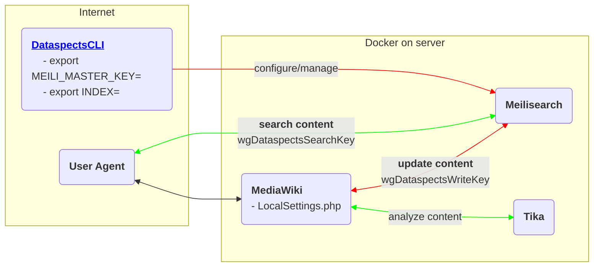

# dataspects for MediaWiki

dataspects for MediaWiki is based on [Meilisearch](https://www.meilisearch.com) and [instant-meilisearch](https://github.com/meilisearch/instant-meilisearch).

[dataspects TDM Documentation](https://htmlpreview.github.io/?https://github.com/dataspects/mediawiki-extensions-Dataspects/blob/master/doc.html)



## Features

* [Concept "SeaKay"](https://wiki.dataspects.com/wiki/C1537999723)

## **PENDING**

* onPageSave index CRUD hooks
* Logging
* Testing
* Delete docs from indexes?

## LocalSettings.php

```php
wfLoadExtension( 'Dataspects' );
$wgDataspectsTikaURL = "http://tika:9998";
$wgDataspectsWriteURL = "http://meili:7700";
$wgDataspectsSearchURL = "http://localhost:7700";

# See later section "Keys" about how to set these keys
$wgDataspectsSearchKey = "";       # Used by class SpecialDataspects
$wgDataspectsWriteKey = "";        # Used by class DataspectsFeed

# See later section "Keys" about how to create/configure this index
$wgDataspectsIndex = "mediawiki";
$wgDataspectsSourcesForAnonymous = [];
$wgDataspectsSourcesForAuthenticated = [];
$wgDataspectsMediaWikiIDPrefix = "dscan"; # together with the page ID, this represents the index doc id

# This will direct full text searches to dataspects
$wgDisableTextSearch = true;
$wgSearchForwardUrl = "/wiki/Special:Dataspects?q=$1";
```

## Keys

See https://github.com/dataspects/DataspectsCLI

* `create-mediawiki-keys.sh`
* `get-all-keys.sh`

## Indexes

See https://github.com/dataspects/DataspectsCLI

* `create-mediawiki-indexes.sh`
* `list-all-indexes.sh`
* `update-mediawiki-indexes-settings.sh`
* `mediawiki-settings.sh`

## Manual indexing

Allows per-MediaWiki-namespace indexing
`sudo docker exec canasta-dockercompose_web_1 bash -c 'php extensions/Dataspects/maintenance/feedAll.php'`

## Example: configure dataspects for [Canasta](https://canasta.wiki/)

### Fixme

1. Add to Canasta MediaWiki container: `composer require --with-all-dependencies meilisearch/meilisearch-php:0.25.0 symfony/http-client laudis/neo4j-php-client`

## Test
```bash
sudo docker exec -it canasta-dockercompose_web_1 /bin/bash
root@95e3ef5ecc17:/var/www/mediawiki/w# php tests/phpunit/phpunit.php \
  extensions/Dataspects/tests/phpunit/unit/DataspectsTest.php
```

Debug API: https://localhost/w/api.php
## Develop

1. `image: getmeili/meilisearch:v0.28.1`<br/>`image: apache/tika:2.4.1-full`
2. Clone the test data: https://mwstakeorg.dataspects.com/wiki/C1728772915
3. `$wgDataspectsSearchURL = "http://localhost:7700";`<br/>`$wgDataspectsWriteURL = "http://localhost:7700";`<br/>`$wgDataspectsSearchKey = "masterKey";`<br/>
`$wgDataspectsWriteKey = "masterKey";`       
1. Reindex/develop Meilisearch: https://github.com/dataspects/DataspectsCLI<br/>E.g. `php extensions/Dataspects/maintenance/feedOne.php`
1. Update JS code: LEX2208021344


### Tika

```bash
#!/bin/bash

# https://cwiki.apache.org/confluence/display/TIKA/TikaServerEndpointsCompared
curl \
    -T /home/lex/python-regular-expressions-cheat-sheet.pdf \
    http://localhost:9998/rmeta
```

## Logs

```bash
sudo docker exec -it canasta-dockercompose_web_1 /bin/bash
tail -f  apache2/error_log.current
```

## See also
* https://www.digitalocean.com/community/tutorials/how-to-run-a-meilisearch-frontend-using-instantsearch-on-ubuntu-22-04


## Upgrade JS libraries

yarn add/update the libraries and then copy the corresponding files into place.

**Install nvm/node**
curl -o- https://raw.githubusercontent.com/nvm-sh/nvm/v0.39.2/install.sh | bash
nvm ls-remote --lts
nvm install v16.18.0
npm install -g yarn

**yarn add the libs**
lex@lexThinkPad:~/Downloads/dataspects-search-js-libraries$ yarn add \
                                                            @meilisearch/instant-meilisearch instantsearch.js vis-network

**Copy into place, e.g.**
lex@lexThinkPad:~/Downloads/dataspects-search-js-libraries$ cp node_modules/vis-network/dist/vis-network.min.js ~/mwstakeorgdevclone/extensions/Dataspects/resources/ext.dataspectsSearch/