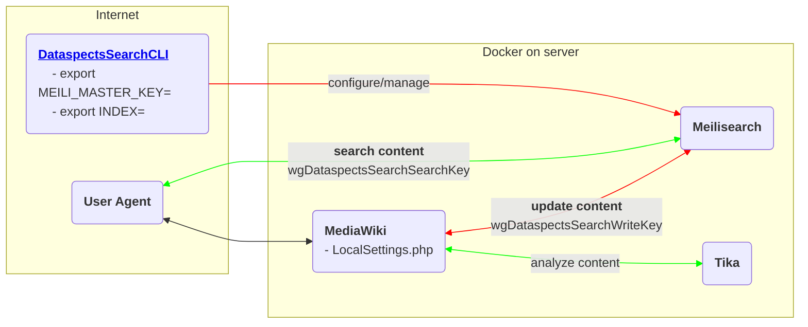

# dataspects Search for MediaWiki

dataspects Search for MediaWiki is based on [Meilisearch](https://www.meilisearch.com) and [instant-meilisearch](https://github.com/meilisearch/instant-meilisearch).



## Features

* [Concept "SeaKay"](https://wiki.dataspects.com/wiki/C1537999723)

## **PENDING**

* onPageSave index CRUD hooks
* Logging
* Testing
* Delete docs from indexes?

## LocalSettings.php

```php
wfLoadExtension( 'DataspectsSearch' );
$wgDataspectsSearchTikaURL = "http://tika:9998";
$wgDataspectsSearchWriteURL = "http://meili:7700";
$wgDataspectsSearchSearchURL = "http://localhost:7700";

# See later section "Keys" about how to set these keys
$wgDataspectsSearchSearchKey = "";       # Used by class SpecialDataspectsSearch
$wgDataspectsSearchWriteKey = "";        # Used by class DataspectsSearchFeed

# See later section "Keys" about how to create/configure this index
$wgDataspectsSearchIndex = "mediawiki";
$wgDataspectsSearchSourcesForAnonymous = [];
$wgDataspectsSearchSourcesForAuthenticated = [];
$wgDataspectsSearchMediaWikiIDPrefix = "dscan"; # together with the page ID, this represents the index doc id

# This will direct full text searches to dataspects Search
$wgDisableTextSearch = true;
$wgSearchForwardUrl = "/wiki/Special:DataspectsSearch?q=$1";
```

## Keys

See https://github.com/dataspects/DataspectsSearchCLI

* `create-mediawiki-keys.sh`
* `get-all-keys.sh`

## Indexes

See https://github.com/dataspects/DataspectsSearchCLI

* `create-mediawiki-indexes.sh`
* `list-all-indexes.sh`
* `update-mediawiki-indexes-settings.sh`
* `mediawiki-settings.sh`

## Manual indexing

Allows per-MediaWiki-namespace indexing
`sudo docker exec canasta-dockercompose_web_1 bash -c 'php extensions/DataspectsSearch/maintenance/feedAll.php'`

## Example: configure dataspects Search for [Canasta](https://canasta.wiki/)

### Fixme

1. Add to Canasta MediaWiki container: `sudo docker exec mwstakeorgdevclone_web_1 bash -c 'composer require meilisearch/meilisearch-php guzzlehttp/guzzle http-interop/http-factory-guzzle:^1.0'`

## Test
```bash
sudo docker exec -it canasta-dockercompose_web_1 /bin/bash
root@95e3ef5ecc17:/var/www/mediawiki/w# php tests/phpunit/phpunit.php \
  extensions/DataspectsSearch/tests/phpunit/unit/DataspectsSearchTest.php
```

## Develop

1. `image: getmeili/meilisearch:v0.28.1`<br/>`image: apache/tika:2.4.1-full`
2. Clone the test data: https://mwstakeorg.dataspects.com/wiki/C1728772915
3. `$wgDataspectsSearchSearchURL = "http://localhost:7700";`<br/>`$wgDataspectsSearchWriteURL = "http://localhost:7700";`<br/>`$wgDataspectsSearchSearchKey = "masterKey";`<br/>
`$wgDataspectsSearchWriteKey = "masterKey";`       
1. Reindex/develop Meilisearch: https://github.com/dataspects/DataspectsSearchCLI<br/>E.g. `php extensions/DataspectsSearch/maintenance/feedOne.php`
1. Update JS code: LEX2208021344


### Tika

```bash
#!/bin/bash

# https://cwiki.apache.org/confluence/display/TIKA/TikaServerEndpointsCompared
curl \
    -T /home/lex/python-regular-expressions-cheat-sheet.pdf \
    http://localhost:9998/rmeta
```

## Logs

```bash
sudo docker exec -it canasta-dockercompose_web_1 /bin/bash
tail -f  apache2/error_log.current
```

## See also
* https://www.digitalocean.com/community/tutorials/how-to-run-a-meilisearch-frontend-using-instantsearch-on-ubuntu-22-04

