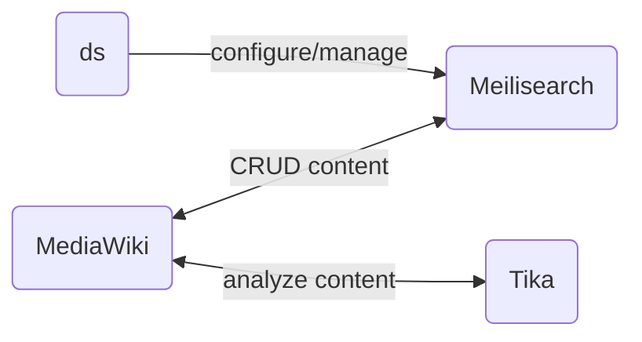

# dataspects Search for MediaWiki

dataspects Search for MediaWiki is based on [Meilisearch](https://www.meilisearch.com) and [instant-meilisearch](https://github.com/meilisearch/instant-meilisearch).



## LocalSettings.php

```php
wfLoadExtension( 'DataspectsSearch' );
$wgDataspectsSearchTikaURL = "http://tika:9998";
$wgDataspectsSearchMeiliURL = "http://meili:7700";
$wgDataspectsSearchSearchKey = "";              # Used by class SpecialDataspectsSearch
$wgDataspectsSearchWriteKey = "";        # Used by class DataspectsSearchFeed
$wgDataspectsSearchIndex = "mediawiki";
$wgDataspectsSearchMediaWikiID = "dscan"; # together with the page ID, this represents the index doc id

# This will direct full text searches to dataspects Search
$wgDisableTextSearch = true;
$wgSearchForwardUrl = "/wiki/Special:DataspectsSearch?q=$1";
```

## Keys

* create-mediawiki-keys.sh

## Manual indexing

```bash
php extensions/DataspectsSearch/maintenance/feedAll.php # Allows per-MediaWiki-namespace indexing
```

## Example: configure dataspects Search for [Canasta](https://canasta.wiki/)

### Fixme

1. Add to Canasta MediaWiki container: `composer require meilisearch/meilisearch-php guzzlehttp/guzzle http-interop/http-factory-guzzle:^1.0`
2. 

### docker-compose.override.yml


```yaml
services:
  tika:
    container_name: tika
    image: apache/tika:2.4.0-full
    ports:
      - "9998:9998"
  meili:
    container_name: meili
    image: getmeili/meilisearch:v0.27.2
    ports:
      - 7700:7700
    environment:
      - MEILI_MASTER_KEY=
    volumes:
      - meili_data:/meili_data
volumes:
  meili_data:
```

## Test
```bash
sudo docker exec -it canasta-dockercompose_web_1 /bin/bash
root@95e3ef5ecc17:/var/www/mediawiki/w# php tests/phpunit/phpunit.php \
  extensions/DataspectsSearch/tests/phpunit/unit/DataspectsSearchTest.php
```


## Develop

```bash
root@95e3ef5ecc17:/var/www/mediawiki/w# clear; php extensions/DataspectsSearch/maintenance/feedOne.php
lex@lexYoga:~/MVP/MeiliSearch$ MEILI_MASTER_KEY=masterKey ./getDocument.sh

tail -f  apache2/error_log.current
```

https://www.digitalocean.com/community/tutorials/how-to-run-a-meilisearch-frontend-using-instantsearch-on-ubuntu-22-04