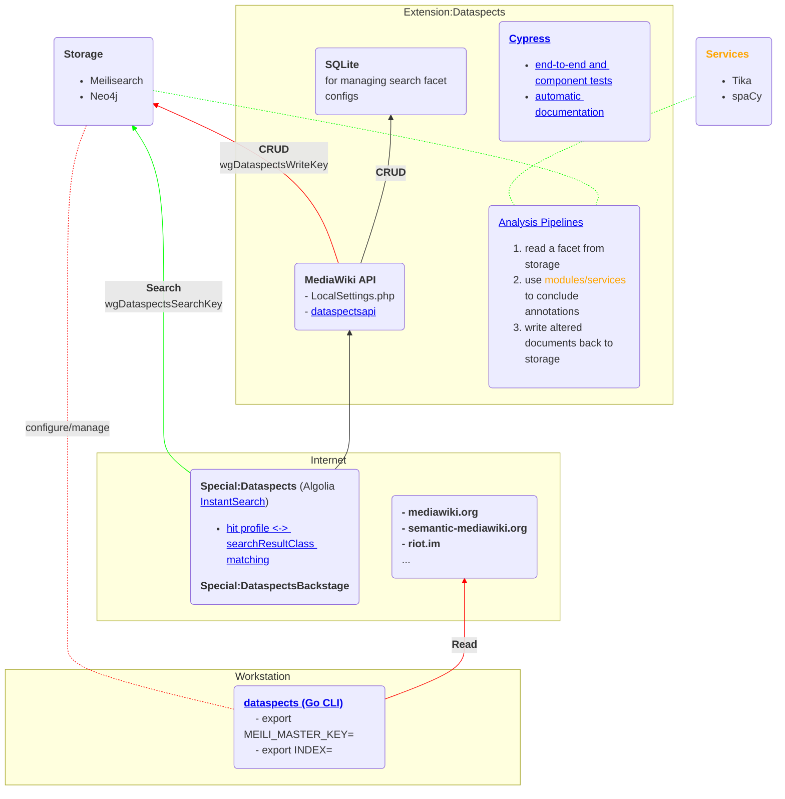

# dataspects for MediaWiki

dataspects for MediaWiki is based on [Meilisearch](https://www.meilisearch.com) and [instant-meilisearch](https://github.com/meilisearch/instant-meilisearch).

[dataspects TDM Documentation](https://htmlpreview.github.io/?https://github.com/dataspects/mediawiki-extensions-Dataspects/blob/master/doc/search-facets.cy.js.html)



## Features

- [EPPO](https://mwstakeorg.dataspects.com/wiki/EPPO) | [Namespaces](https://mwstakeorg.dataspects.com/wiki/Namespaces)
- [DataspectsAPI](https://github.com/dataspects/mediawiki-extensions-Dataspects/blob/main/includes/api/DataspectsAPI.php) | [dataspectsapi](https://mwstakeorg.dataspects.com/w/api.php?action=help&modules=dataspectsapi)
- Explain a facet: [Module:ExplainFacet](https://mwstakeorg.dataspects.com/wiki/Module:ExplainFacet) | [Aspect "The MWStake story"](https://mwstakeorg.dataspects.com/wiki/Aspect_%22The_MWStake_story%22)
- **Curate HTML** before indexing, see [wgHTMLElementsToBeRemovedBeforeIndexingContent](https://github.com/dataspects/mediawiki-extensions-Dataspects/search?q=wgHTMLElementsToBeRemovedBeforeIndexingContent)
- [AnalyzeAndAnnotateMeiliDocs](https://github.com/dataspects/mediawiki-extensions-Dataspects/search?q=AnalyzeAndAnnotateMeiliDocs)

### [Special:Dataspects](https://mwstakeorg.dataspects.com/wiki/Special:Dataspects)

- implements **[Algolia's InstantSearch](https://github.com/meilisearch/instant-meilisearch)**
- provides **meta data on search results**: currently 'last indexed' and 'searchResultClass', see [LEX230108155400](https://github.com/dataspects/mediawiki-extensions-Dataspects/search?q=LEX230108155400)
- formats the controlled use of **[cognitive keywords (CoKe)](https://wiki.dataspects.com/wiki/C1537999723)**, see [LEX230108160200](https://github.com/dataspects/mediawiki-extensions-Dataspects/search?q=LEX230108160200)
- **save search facets**, see [LEX230108163200](https://github.com/dataspects/mediawiki-extensions-Dataspects/search?q=LEX230108163200), <code>maintenance/manageSQlite3.php --initialize</code>
- show **original page contents** under search results, see [LEX230108165801](https://github.com/dataspects/mediawiki-extensions-Dataspects/search?q=LEX230108165801)
- compact search results, see [LEX230108165800](https://github.com/dataspects/mediawiki-extensions-Dataspects/search?q=LEX230108165800)
- enable **multiple sources**
- search includes **non-article pages** (i.e. templates, forms, etc.), see [onPageSaveComplete](https://github.com/dataspects/mediawiki-extensions-Dataspects/search?q=onPageSaveComplete)
  - reveal nested template calls graphically, see [LEX230108161800](https://github.com/dataspects/mediawiki-extensions-Dataspects/search?q=LEX230108161800)
- extracts and indexes metadata and text from uploaded files, see [DataspectsTikaJob](https://github.com/dataspects/mediawiki-extensions-Dataspects/search?q=DataspectsTikaJob)

### [Special:DataspectsBackstage](https://mwstakeorg.dataspects.com/wiki/Special:DataspectsBackstage)

- initialize new **[EPPO topic types](https://mwstakeorg.dataspects.com/wiki/EPPO)**, see [LEX230108161000](https://github.com/dataspects/mediawiki-extensions-Dataspects/search?q=LEX230108161000)
- see **statistics on indexing activity**, see [LEX230108165200](https://github.com/dataspects/mediawiki-extensions-Dataspects/search?q=LEX230108165200)
- see **statistics on data sources**, see [LEX230108165201](https://github.com/dataspects/mediawiki-extensions-Dataspects/search?q=LEX230108165201)
- check current **dataspects configuration**, see [LEX230108165600](https://github.com/dataspects/mediawiki-extensions-Dataspects/search?q=LEX230108165600)

## **PENDING**

- Delete docs from indexes

## Manual indexing

Allows per-MediaWiki-namespace indexing
`sudo docker exec canasta-dockercompose_web_1 bash -c 'php extensions/Dataspects/maintenance/feedAll.php'`

## Example: configure dataspects for [Canasta](https://canasta.wiki/)

### Fixme

1. Add to Canasta MediaWiki container: `composer require --with-all-dependencies meilisearch/meilisearch-php:0.25.0 symfony/http-client laudis/neo4j-php-client`

## TEST

1. RESET: data storage backends (see below _CONFIGURE: the data storage backends_)
2. LOAD: `w# php tests/phpunit/phpunit.php --filter testResetTestData extensions/Dataspects/tests/phpunit/unit/DataspectsTest.php`
3. RUN:
   - Cypress
     - E2E tests
     - Component tests
   - Services tests (TIKA, spaCy)
   - PHP unit tests

```bash
sudo docker exec -it canasta-dockercompose_web_1 /bin/bash
root@95e3ef5ecc17:/var/www/mediawiki/w# php tests/phpunit/phpunit.php \
  extensions/Dataspects/tests/phpunit/unit/DataspectsTest.php
```

Debug API: https://localhost/w/api.php

## DOCUMENT

- ACTION: `mwstakeorg__localhost__make-test-documentation-TDM.sh`

## DEVELOP

### CHECK: system status

- [Special:DataspectsBackstage](https://mwstakeorg.dataspects.com/wiki/Special:DataspectsBackstage)
- `mwstakeorg__status.sh`

### CHECK: docker-compose.override.yml

- CHECK: Base images [Meilisearch](https://hub.docker.com/r/getmeili/meilisearch/tags), [Neo4j](https://hub.docker.com/_/neo4j/tags), [Tika](https://hub.docker.com/r/apache/tika/tags)
- CHECK: Derived images [canasta-dataspects](https://hub.docker.com/r/dataspects/canasta-dataspects/tags), [spacy-dataspects](https://hub.docker.com/r/dataspects/spacy-dataspects/tags)
- CHECK: Environment variables in `.env` which set `$wgDataspects*` variables in `LocalSettings.php`

### CONFIGURE: the environment for Extension:Dataspects

- OPTION: temporarily change `$wgDataspects*` variables in `LocalSettings.php`:
  - ADVANTAGES:
    - no need to restart the Docker compose stack
    - preserve proper development `.env`

### CONFIGURE: the data storage backends

- PREPARE: `source *.config` files (e.g. `localhost.config` and `production.config`) _exporting_ the environment variables
  - RESET Meilisearch: `meilisearch__reset-INDEX.sh` which applies `src/indexsettings.json`
- RESET SQLite:
  1. delete `sqlite/dataspects.sqlite`
  2. run `php extensions/Dataspects/maintenance/manageSQlite3.php --initialize`
- RESET Neo4j:
  - `MATCH(n&lt;:label(:s)&gt;) DETACH DELETE n`

### Tika

```bash
#!/bin/bash

# https://cwiki.apache.org/confluence/display/TIKA/TikaServerEndpointsCompared
curl \
    -T /home/lex/python-regular-expressions-cheat-sheet.pdf \
    http://localhost:9998/rmeta
```

## Logs

```bash
sudo docker exec -it canasta-dockercompose_web_1 /bin/bash
tail -f  apache2/error_log.current
```

## See also

- https://www.digitalocean.com/community/tutorials/how-to-run-a-meilisearch-frontend-using-instantsearch-on-ubuntu-22-04

## Upgrade JS libraries

yarn add/update the libraries and then copy the corresponding files into place.

**Install nvm/node**
curl -o- https://raw.githubusercontent.com/nvm-sh/nvm/v0.39.2/install.sh | bash
nvm ls-remote --lts
nvm install v16.18.0
npm install -g yarn

**yarn add the libs**
lex@lexThinkPad:~/Downloads/dataspects-search-js-libraries$ yarn add \
 @meilisearch/instant-meilisearch instantsearch.js vis-network

**Copy into place, e.g.**
lex@lexThinkPad:~/Downloads/dataspects-search-js-libraries$ cp node_modules/vis-network/dist/vis-network.min.js ~/mwstakeorgdevclone/extensions/Dataspects/resources/ext.dataspectsSearch/

https://datatables.net/download/
